# Predicting NHL Game Penalty Minutes

This project is the results of a machine learning experiment that considers historical hockey games from 2001 - 2020 to build a regression model capable of predicting the number of penalty minutes that might be expected for a given NHL hockey game factoring in only the home team, the away team, and whether the game was a playoff game or regular season matchup.

The resulting model could potentially be used to allocate more experienced officials to officiate matchups that we predict have a higher-than usual number of penalties as those games may benefit from more experienced or stricter officiating in order to keep the game safe and enjoyable for all.

A video introduction of this project is available [on my data science YouTube channel](https://youtu.be/zqiWpl4Gezg)

_**A quick primer on penalties:** In hockey, when a team commits a penalty, a player is assessed either a 2 minute minor penalty or a 5 minute major penalty for more egregious incidents. During this time, teams must play with one fewer skater than the other team, effectively putting them at a disadvantage._

## Approach

In order to accomplish this machine learning task, I used an open [NHL dataset on Kaggle](https://www.kaggle.com/datasets/martinellis/nhl-game-data?rvi=1) and trained and evaluated models on my Azure subscription using the following techniques:

- Linear Regression via Hyperdrive
- A ML Designer Linear Regression Model with Hyperparameter Tuning
- A ML Designer Decision Forest Model with Hyperparameter Tuning
- A ML Designer Boosted Decision Tree Regression Model with Hyperparameter Tuning
- A ML Designer Neural Network Regression Model with Hyperparameter Tuning
- A ML Designer Fast-Forward Quantile Model with Hyperparameter Tuning
- A ML Designer Poisson Model with Hyperparameter Tuning
- An Automated ML Regression Task

In the end, I was most pleased with the AutoML model and deployed that as a web service using Azure Container Instances. From there, I made REST calls to generate predictions on every potential regular season and playoff matchup possibility and visualized the results in Plotly Express. The final result can serve as a prototype for a system that could potentially be adopted by the NHL, periodically retrained, and used as a factor when scheduling officials for games.

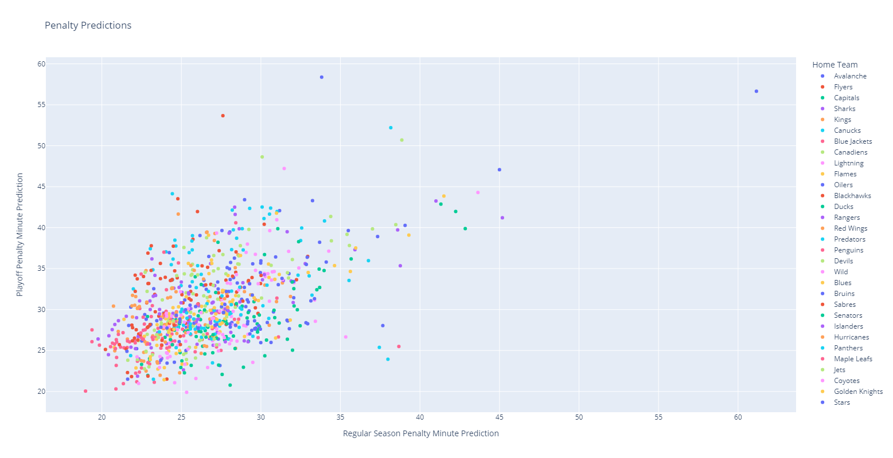

## Project Set Up and Installation
In order to run this application, you will need to have:

- An active Azure subscription with a machine learning workspace and its matching `config.json` file downloaded into the project directory
- Python 3.8 or later installed
- The following libraries installed:
  - Azure ML SDK (including Hyperdrive and AutoML)
  - SciKit Learn
  - Pandas
  - Plotly Express

## Project Structure
This project consists of a few files of interest:

- **readme.md** - this file. An overview of the entire project
- **dataprep.ipynb** - A data preparation and cleaning notebook that transforms the source data into a registered dataset on Azure
- **hyperparameter_tuning.ipynb** - A notebook exploring hyperparameter tuning to train models
- **automl.ipynb** - A notebook using Azure's Automated Machine Learning to train a model. This also registers the model, deploys it as an ACI web service, calls it to generate matchup predictions, and then deletes the deployed web service.
- **visualization.ipynb** - A notebook containing visualizations with the resulting data from the deployed model
- **train/train.py** - The SciKit-learn Linear Regression model trainer used by the hyperparameter experiments

## Dataset
### Overview
Whenever I'm looking for a dataset, I usually start on [Kaggle](https://Kaggle.com) and it didn't let me down this time. I chose to go with a [NHL game data dataset](https://www.kaggle.com/datasets/martinellis/nhl-game-data?rvi=1) that included data on NHL hockey games from 2001 to 2020. While I would have preferred more up-to-date data, getting this data from an open datasource is difficult and this project was more intended to explore a proof of concept than make a working product that feeds off of live data.

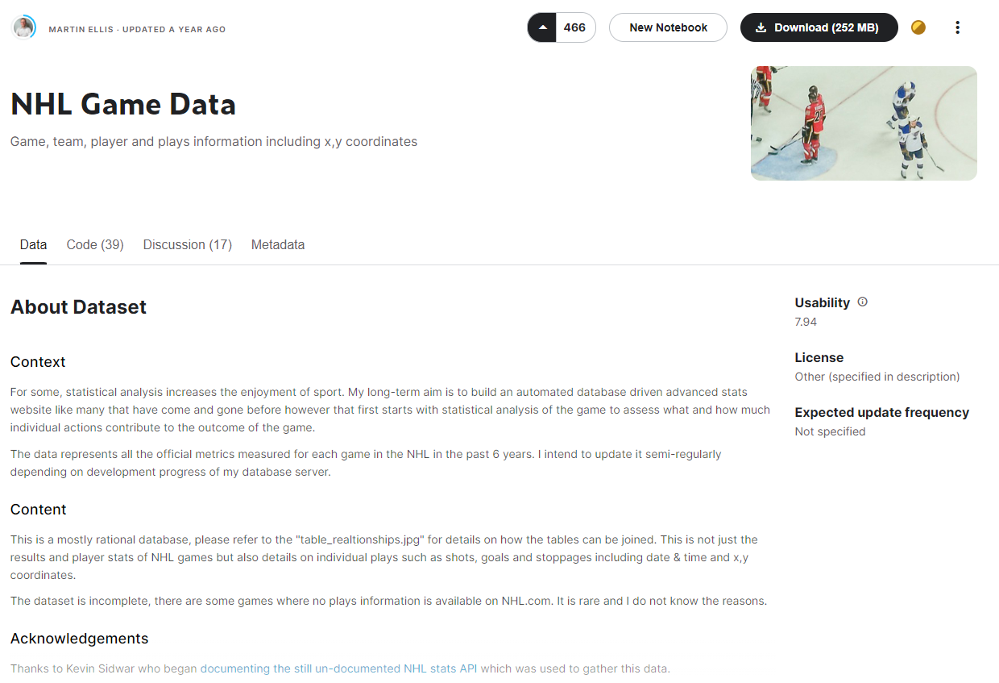

The NHL Games dataset consisted of a number of different CSV files, each representing a different table in a traditional relational database, as pictured below:


Of this data, I needed aggregated penalties per game for both teams, so I ultimately only cared about the following files:

- **game.csv** (for game matchups)
- **game_team_stats.csv** (for aggregated penalties)
- **team_info.csv** (for team names)

The remainder of the CSV files were deleted to avoid storing large files not relevant to the experiment.

I used Pandas and a series of `merge`, `aggregate`, and `groupby` operations to prepare my training dataset. The full process is documented and reproducible in the `dataprep.ipynb` Notebook, but the resulting data looks like this:

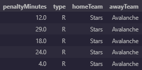

Here **penaltyMinutes** represents the total penalty minutes assessed between the two teams, **type** indicates either a **R**egular season game or a **P**layoff game, and **homeTeam** and **awayTeam** store a human-readable team name.

Once this training dataset was cleaned, it was registered in Azure Machine Learning Studio as a dataset so it could be pulled down from other notebooks. This also let me track different versions of the training data as each register call incremented the version count.

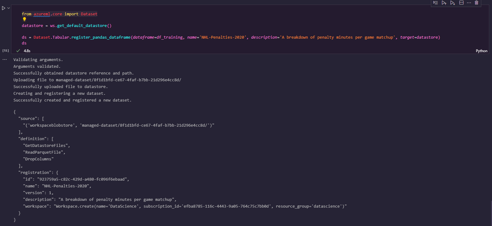
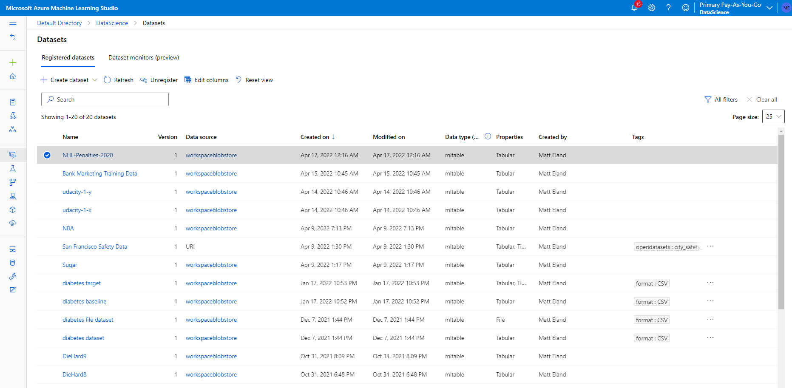
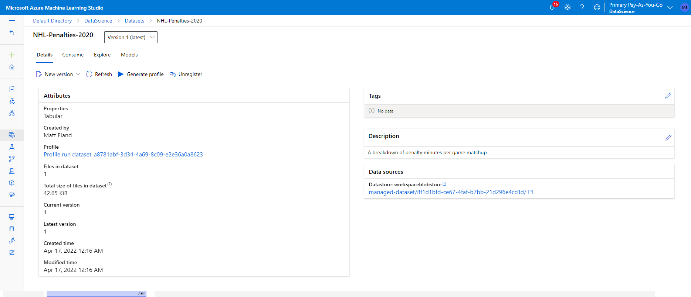

Once on Azure, I also profiled the dataset giving me a good indication of its distribution:
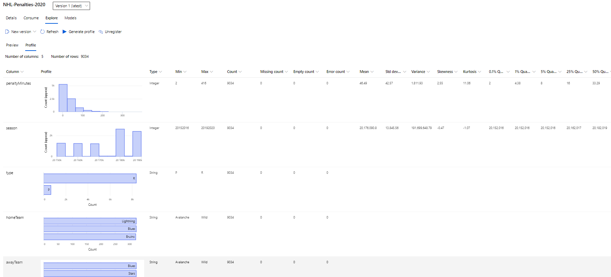

Of particular note, due to the structure of the NHL, the data is going to be slightly imbalanced by its very nature. East and West coast teams do not play each other as much as they play other teams inside of their conference. Additionally, there are far more regular season games than playoff games and many teams will not have any playoff matchups against each other.

This will likely make east / west and playoff matchups slightly less reliable than intra-conference matchups.

### Task
I am looking at predicting the total penalty minutes assessed to both teams for any given NHL hockey matchup using only the information that would be available far before the game occurred, which is primarily the home team, the away team, and whether or not the game was a playoff game. By relying on so few data sources, the machine learning task becomes more difficult, but the resulting model's usefulness increases because it could be used for scheduling seasoned officials to hotspot games far in advance of those games.

Since I'm looking to predict a numerical value, this is a **regression** task and I should consider regression algorithms and use regression metrics for evaluation.

### Workspace Access
This application relies on a `config.json` present in the project directory for most notebooks as this will allow access to the appropriate Azure Workplace. Due to security reasons, I have not included this file in my project, but you can download a config.json from your machine learning instance by navigating to its summary page in the Azure portal and clicking the **Download config.json** button.

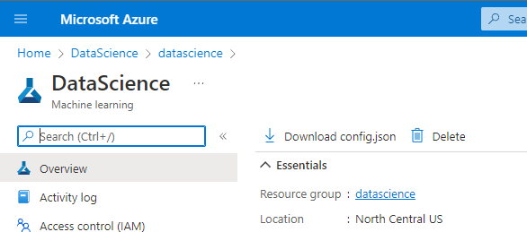

Once this file is present, the workspace can easily be accessed from notebooks using the Azure ML SDK and the `Workspace.from_config()` method.

In a similar way, the processed dataset prepared in the `dataprep.ipynb` notebook can be accessed via code like the following:

```py
ws = Workspace.from_config() # config.json must be present
ds = Dataset.get_by_name(workspace=ws, name='NHL-Penalties-2020')
```

## Hyperparameter Tuning
The first model considered used Hyperdrive to tune hyperparameters of a SciKit-learn Linear Regression experiment. This process is detailed in `hyperparameter_tuning.ipynb`.

I chose LinearRegression as my algorithm because it tends to be a simple and fast default regression algorithm that is easy to explain to others. It only takes in a handful of hyperparameters, however, so this limited the utility of Hyperdrive in fitting the best model possible.

LinearRegression produces an R Squared metric when fitting and this is generally a reliable metric that you want to minimize for the best model, so I used this for my evaluation criterion.

The hyperparameters that were exposed to Hyperdrive are:

- **normalize** - whether or not the data should be normalized prior to fitting the model
- **fit** - whether or not the model should try to fit to the Y-Intercept
- **split** - the percent of data to reserve for validation vs the proportion to use when fitting the model

`normalize` and `fit` were both boolean parameters that would either be a `0` or a `1` whereas `split` represented a range of values anywhere from 5% to 50% of the training dataset.

In the end, the best set of parameters wound up being to normalize, to not fit, and to keep about 19% of the data for validation.

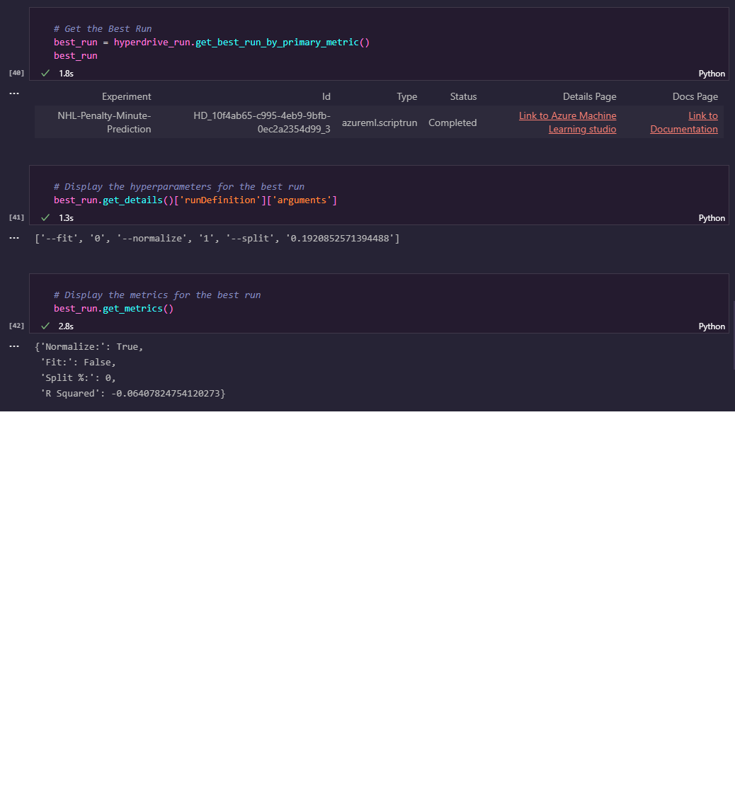

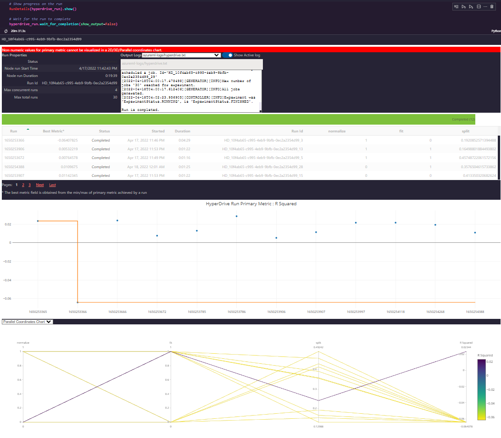

### Results
However, most runs produced very comparable R Squared scores and I largely felt the hyperparameters didn't contribute terribly to the performance of the model, potentially making hyperdrive a bit of overkill for the simplistic LinearRegression algorithm.

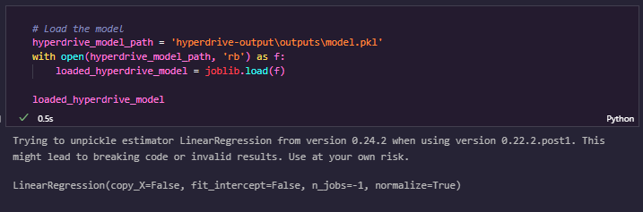

Because the training data discards many factors such as the relative standings of both teams, the officials, the time of year, and even the season of play, high accuracy on any model is going to be very difficult.

I do not think that I could significantly improve the performance of this model without retooling the training data that I give the model (which would change the way it would eventually be used) or by using a more complex algorithm.

However, the end result was registered in Azure Machine Learning Studio via the Azure ML SDK.

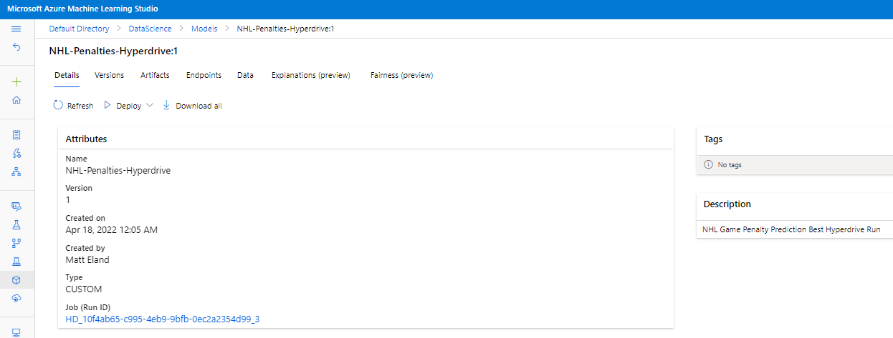

## Designer

In order to explore other training algorithms, I decided to try to run this experiment using the Azure Machine Learning Studio designer and train each of the 6 different available regression algorithms on the dataset with hyperparameter tuning enabled.

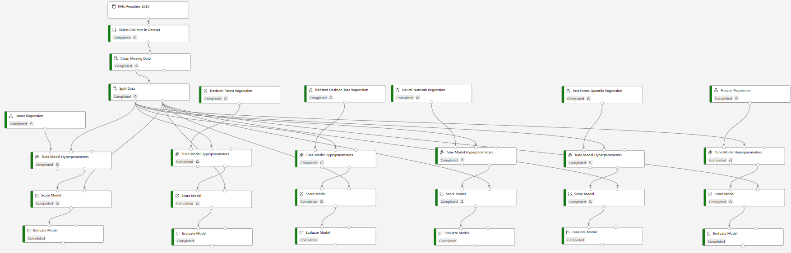

This no-code approach produced 6 different models that could potentially be used.

### Results

The resulting models had the following performance characteristics.

| Model | R Squared | MAE | RAE | RSE | RMSE |
|-------|-----------|-----|-----|-----|------|
| **Linear Regression** | 0.013 | 13.652 | 0.989 | 0.987 | 19.844 |
| **Decision Forest Regression** | 0.027 | 13.597 | 0.985 | 0.973 | 19.706 |
| **Boosted Decision Tree Regression** | 0.034 | 13.566 | 0.982 | 0.966 | 19.631 |
| **Neural Network Regression** | -0.017 | 13.917 | 1.008 | 1.017 | 20.147 |
| **Poisson Regression** | 0.013 | 13.645 | 0.988 | 0.987 | 19.842 |

Note: Fast Forest Quantile Regression tracks different metrics as shown below:

| Model | Average Quantile Loss | Quantile Loss:0.250 | Quantile Loss:0.500 | Quantile Loss:0.750 |
|-------|-----------|-----|-----|-----|
| **Fast Forest Quantile Regression** | 6.451 | 5.867 | 6.827 | 6.659 |

All-told, I would likely go with the Poisson Regression algorithm here given its performance characteristics, though it is very close to Linear Regression.

However, none of these is giving me a significant amount of model explainability which is something that is important to consider when deploying a machine learning model.

## Automated ML

I am generally biased towards Azure's AutoML capabilities because the model explanability features tend to give me a much deeper understanding of the model I may want to deploy, the model performance metrics tend to be fantastically useful, and the model quality is often better than anything I could come up with myself.

I ran an automated ML run targeting a regression task aimed at optimizing the normalized mean absolute error to give the best overall model performance. I went with a maximum of 40 iterations and 5 cross validation folds on a dataset of a little over 9100 rows and 4 columns because I wanted to maximize the model's performance given a challenging and somewhat contradictory training dataset (contradictory in that teams play each other multiple times and generate different penalties in minutes per game).

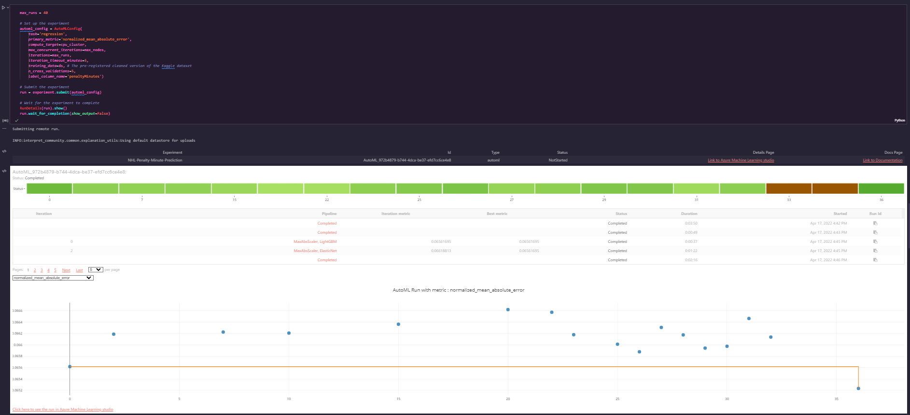

The resulting model was somewhat interesting in its performance:

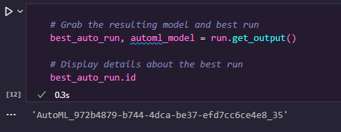
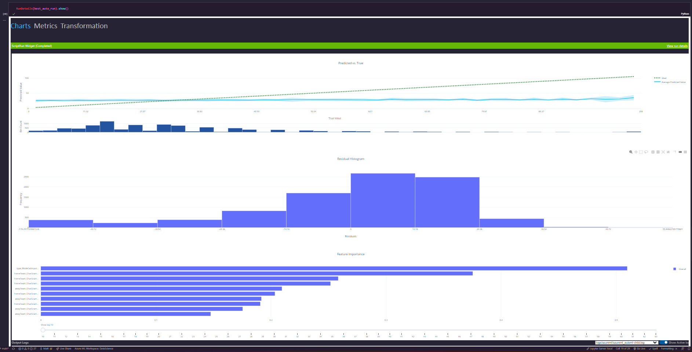

In general this model performed well for most games, but tended to have some problems in the extreme ranges for very high and very low penalty games.

### Results

The resulting metrics were also interesting:

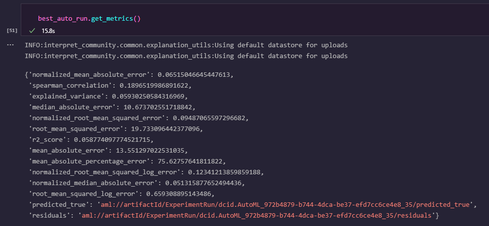

While the designer and hyperparameter runs aimed to minimize the R Squared values, the AutoML models aimed to minimize the overall RMSE and provide a relative degree of accuracy for most games at the expense of performance on outliers.

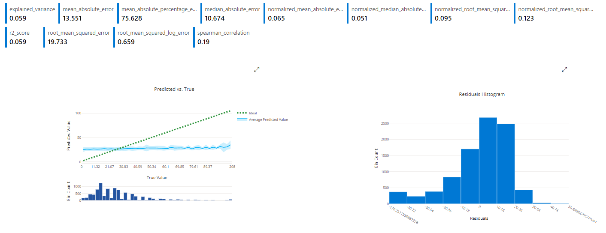

While the resulting model may not exactly predict these outlier games, it should still predict them as relatively high or low compared to the norm, which will meet our needs for flagging these games for more experienced officiating.

Further improvement may be possible by selecting other metrics to optimize beyond RMSE. Of course, the comments on improving model performance by providing more context in the training data would help here as well, though they would change our requirements for using the model as well.

The model itself is a voting ensemble consisting of 9 different algorithms of varying weight, allowing it to have a fairly nuanced view of the data it works with. This is the type of thing that is technically possible to construct, but AutoML is very good at automatically generating for you.

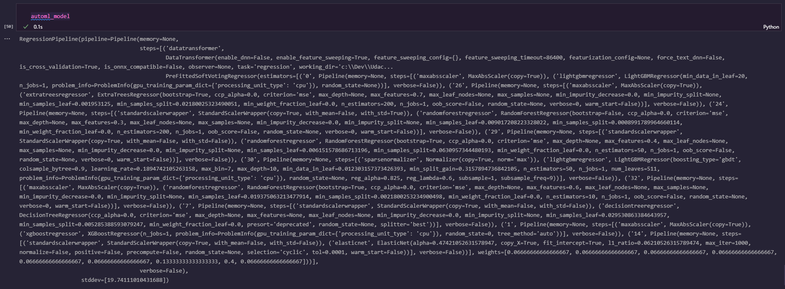

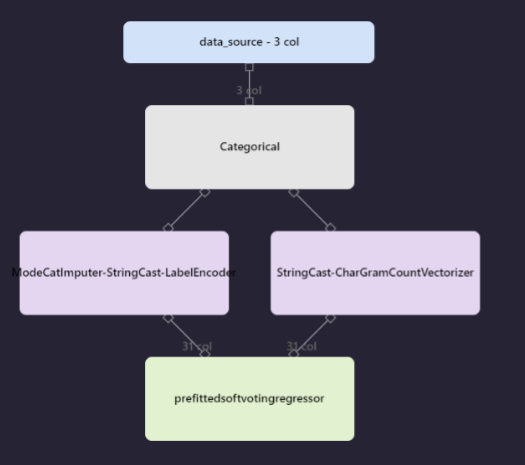

The model keys almost equally of of the home and away teams for their impact on the total penalties, though the home team tends to have slightly greater impact with outliers

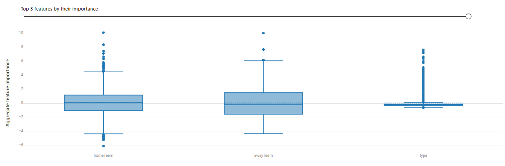

This makes sense since the home team's crowd may cheer them on as play gets more aggressive and many home teams who are losing will often try to cause a scrum with their 4th line of players in order to re-energize the crowd and their teammates and build some momentum.

Additionally, the type of game (regular vs playoff) matters significantly for penalties with playoff games having relatively fewer penalties - in part due to the quality of teams who make it to the playoffs as well as the disadvantages a penalty carries with it and the importance of each playoff game.

## Model Deployment
I chose to deploy the AutoML run because the additional metrics and explainability built into AutoML gave me the greatest confidence in that model.

I deployed the model using the Azure ML SDK inside of the `automl.ipynb` notebook. This deployment used authentication with a temporary pair of keys just for testing purposes (in a real production environment those values would come from a config file).

I also enabled App Insights on the deployed ACI instance, though I did not wind up needing this telemetry.

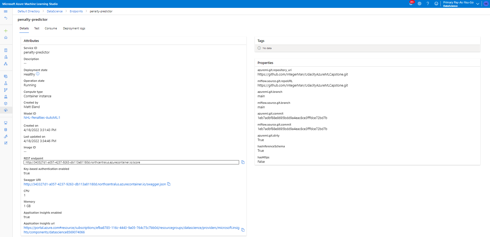

Once that was up and running, I sent it a test request using the test screen

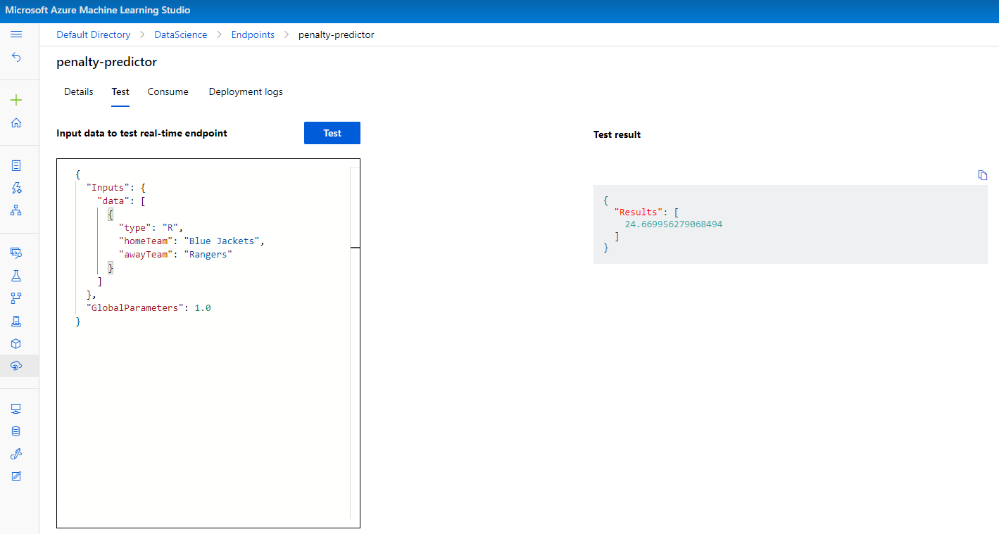

Following a successful response, I wrote a Jupyter Notebook cell in that same notebook to loop through all of the teams in the league and generate a piece of test data for a matchup between that team as the home team and each of the other teams as the away team. I then made a single call to my endpoint to retrieve regular season and playoff penalty estimations for that combination of teams.

The resulting array was then loaded into a Pandas dataframe and saved as a `.csv` file where I could manipulate it for data visualization purposes.

Without a need to keep the service running in perpetuity, I then deleted the deployed endpoint.

## Data Visualization

Once team matchup predictions had been gathered from the endpoint and saved to a file, I opened them up in `visualization.ipynb` for exploratory data analysis with Pandas and Plotly Express and ran a few miscellaneous plots starting with a basic scatter plot.

### Regular vs Postseason Penalty Minutes


This plot shows the regular season vs playoff penalty minute totals for various home teams with coloration also highlighting the home team.

This shows that there's a mostly positive linear correlation between playoff and regular season penalty minutes for teams with most clustered into a standard 30 minutes / game range. However, there are also a number of outliers that have much higher than average totals as well as a few data points that seem to have much higher regular season vs playoffs penalty minutes or vice versa.

This chart is hard to read in image form, but is more intuitive in Plotly with interactive visualizations.

### Team Distributions
Looking at the various teams, we can plot box plots to see the distribution of penalty minutes to see what is normal for teams when they are the home or away teams.

Doing so highlights some of the differences in penalization between various teams in the regular season:

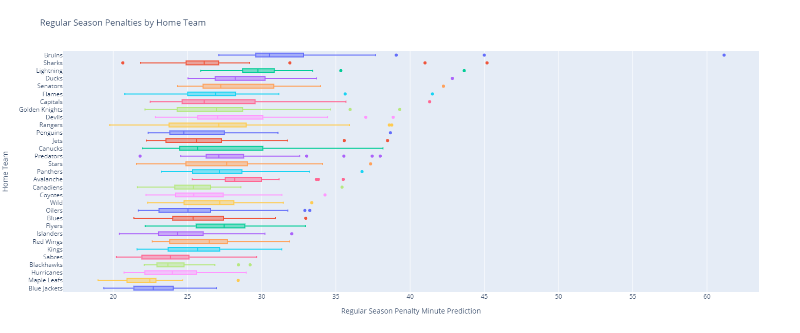
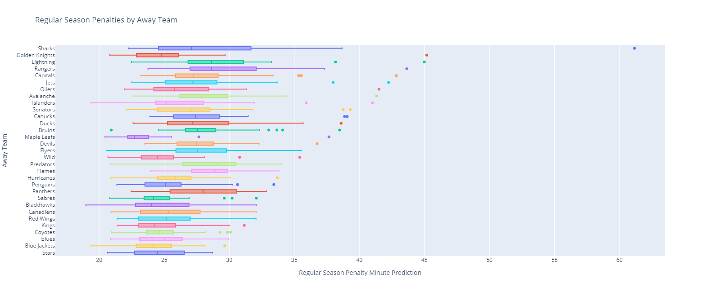

The same thing can be done for playoff games:

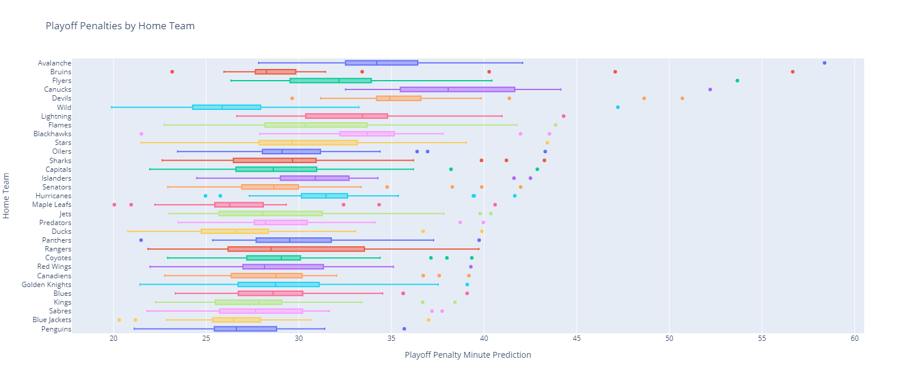
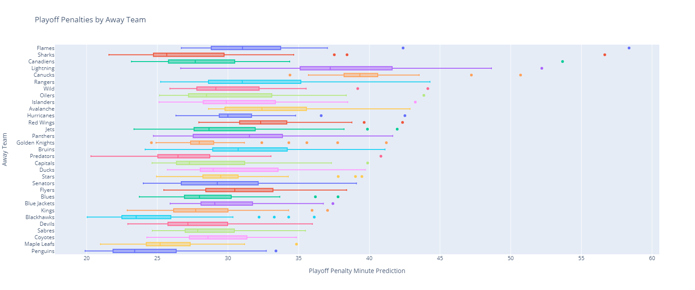

### Heatmaps

While it is interesting to look at individual team trends, it is more useful to our core task to identify games that might generate a high number of penalties to make sure the best officials are present at those games.

To do this, we can generate a bubble plot for each team matchup and size and colorize those bubbles based on the penalty minutes expected in each game in both the regular season and the playoffs.

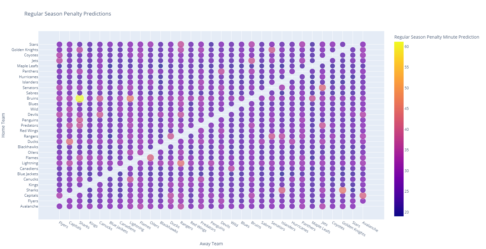

Looking at this charts, we can highlight a number of regular season matchups that need more seasoned officiating (for example, when the Bruins host the Sharks).

More interesting, however is the playoff hotspot map:

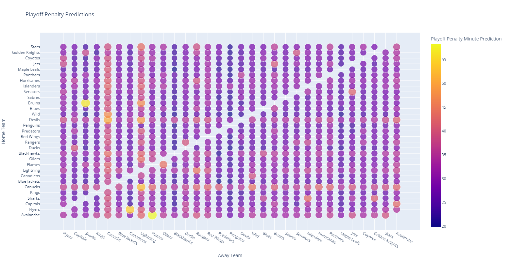

Here we see that when the Canucks and Devils host games, these games tend to have higher degrees of penalization. Similarly, when the Canucks and Lightning are the visiting team, the penalty count tends to skyrocket.

My suspicion on this, however, is that the playoff data is too sensitive given a narrow time window and only a handful of games in those years.

Ultimately, however, these heatmaps are a useful tool to provide to the league with more refinement and more up-to-date data. 

## Conclusion and Future Improvements

This experiment was interesting and has some promise, but to productionize it, I'd want to do some refinements.

First of all, I'd want this training process to be part of a machine learning pipeline that could be triggered on a recurring basis to ensure that the model is trained on an up-to-date dataset.

Secondly, if this experiment was adopted by the league, I'd want them to incorporate an official data source instead of the open Kaggle dataset.

Next, I'd want to drop the type of game from the calculations. Regular season and playoff games differ in their total counts, but teams do not substantively act differently enough in the playoffs that matchups that were problematic in the regular season shouldn't be problematic in the post-season. This would also help more accurately predict values for teams that infrequently play each other.

Finally, the training data should be augmented to include the types of things that are known when officials are scheduled. For example, if games are scheduled a week or two before they occur, the relative points difference between the two teams can be factored into account as imbalanced matchups may generate more penalties than balanced matchups, for example.

Additionally, the league may find that certain officials are more effective with some teams vs others. If this is true, then it might be helpful to include officials in the training data. From there, the league could evaluate the potential penalties per official combination for the next week's worth of games and schedule its officials in order to minimize the total penalties or reduce high penalty games.

To me, this was an interesting exercise in machine learning and data visualization. However, I do think there is some promise here and if machine learning could be applied to predict and reduce high violence NHL games, this is something I hope the league would investigate and consider adopting.